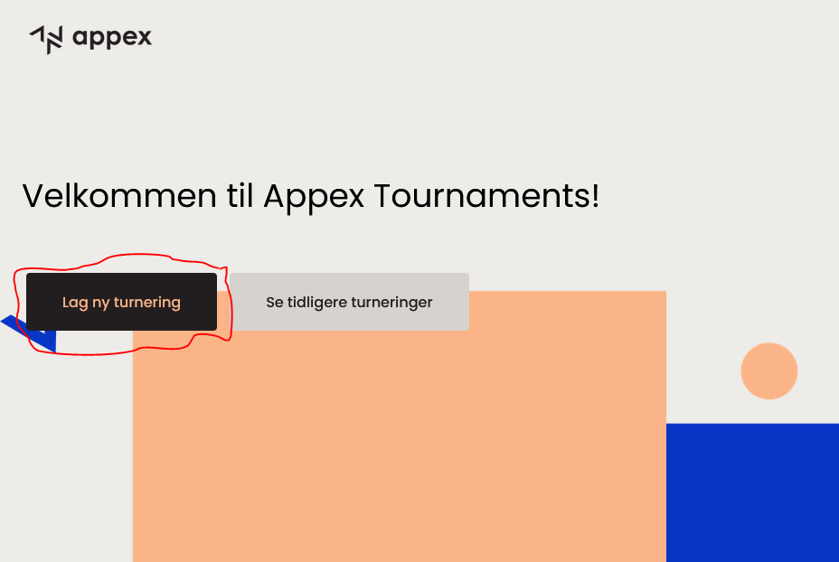
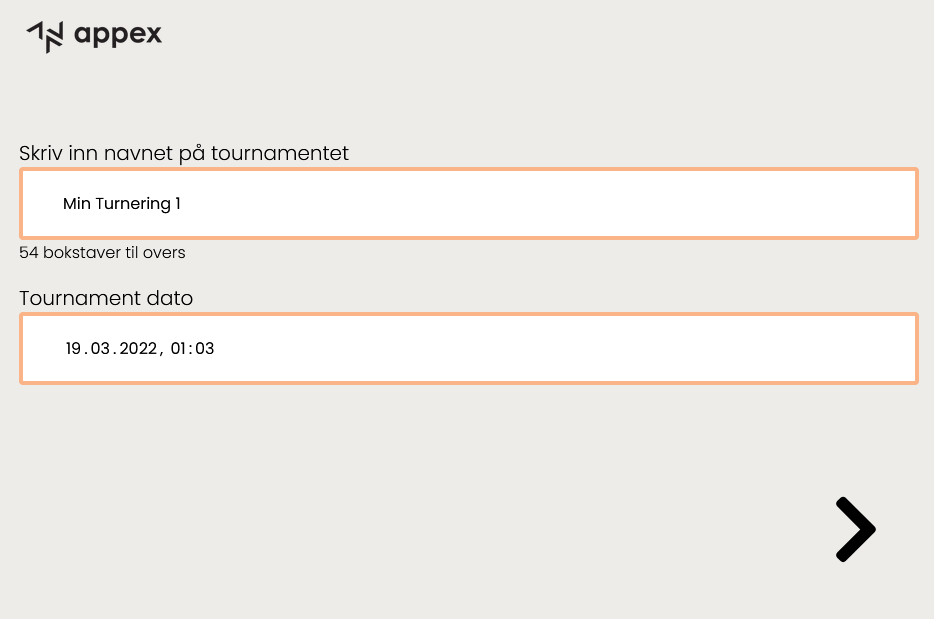
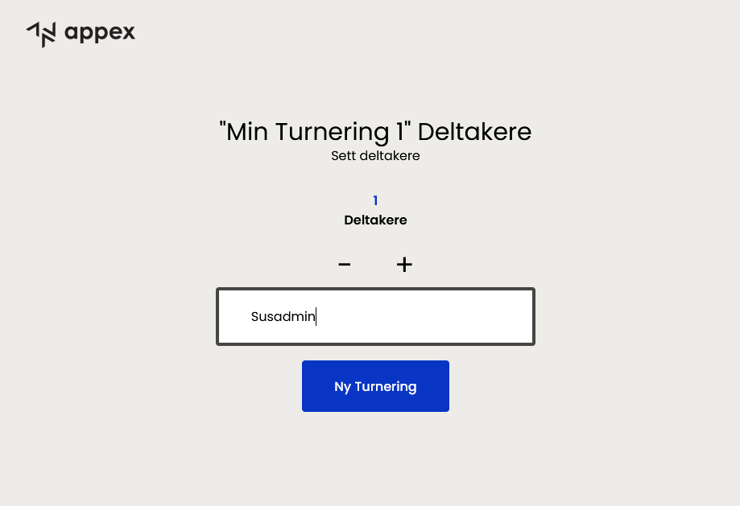
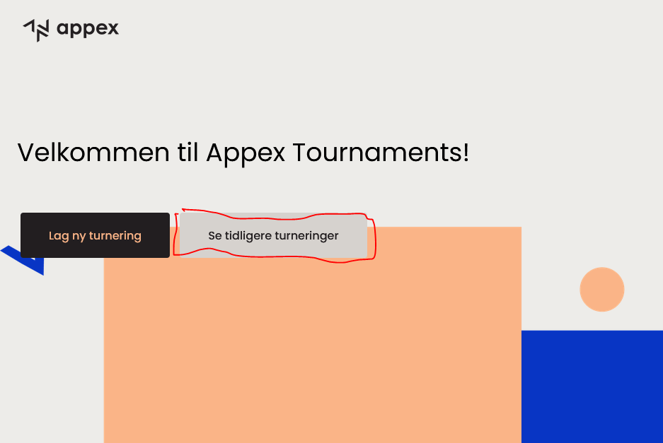
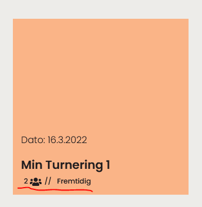
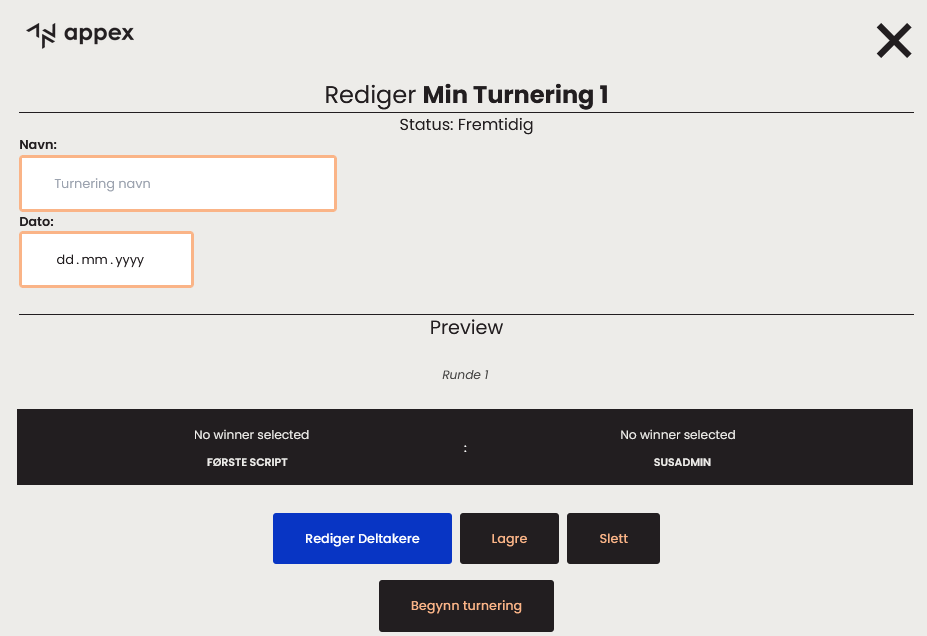

<a name="readme-top"></a>

<div align="center">

[![Contributors][contributors-shield]][contributors-url]
[![Forks][forks-shield]][forks-url]
[![Stargazers][stars-shield]][stars-url]
[![Issues][issues-shield]][issues-url]
[![Version][version-shield]][version-url]

</div>

<br />
<div align="center">
  <a href="https://github.com/ArvidWedtstein/Appex-Tournaments">
    
  </a>

  <h3 align="center">Appex TOurnaments</h3>

  <p align="center">
    Website for managing tournaments
    <br />
    <a href="https://github.com/ArvidWedtstein/Appex-Tournaments"><strong>Explore the docs »</strong></a>
    <br />
    <br />
    <a href="https://github.com/ArvidWedtstein/Appex-Tournaments/issues">Report Bug</a>
    ·
    <a href="https://github.com/ArvidWedtstein/Appex-Tournaments/issues">Request Feature</a>
  </p>
</div>

<details>
  <summary>Table of Contents</summary>
  <ol>
    <li>
      <a href="#about-the-project">About The Project</a>
      <ul>
        <li><a href="#built-with">Built With</a></li>
      </ul>
    </li>
    <li>
      <a href="#getting-started">Getting Started</a>
      <ul>
        <li><a href="#prerequisites">Prerequisites</a></li>
        <li><a href="#installation">Installation</a></li>
      </ul>
    </li>
    <li>
      <a href="#usage">Usage</a>
      <ul>
        <li><a href="#pages">Pages</a></li>
      </ul>
    </li>
    <li><a href="#roadmap">Roadmap</a></li>
    <li><a href="#license">License</a></li>
    <li><a href="#acknowledgments">Acknowledgments</a></li>
  </ol>
</details>

<!-- ABOUT THE PROJECT -->

## About The Project

Project was started with the task to create a system for internal use to create tournaments with a bracket system.  
We used the project to practice our NuxtJS skills and to try out Nuxt 3 (which was barely released at the time back then)

<details>
  <summary>The Quest (Oppgaven)</summary>
	<ol>
    <li>Should work somewhat like [Challonge](https://challonge.com/)</li>
    <li>Use Nuxt 3</li>
    <li>
      <p>Partial Tasks</p>
      <ul>
        <li>
	      <p>Clarify roles in the project</p>
	      <ul>
		<li>Project leader (gives statusupdate every wednesday)</li>
		<li>Designer</li>
		<li>Backend-dev</li>
		<li>Frontend-dev</li>
	      </ul>
	    </li>
        <li>
	      <p>Make a plan for which pages are needed. F.eks:</p>
	      <ul>
		<li>Register tournament</li>
		<li>Tournament player setup preview</li>
		<li>Tournament page for registering match scores</li>
		<li>Page where next page is displayed</li>
		<li>More?</li>
	      </ul>
	    </li>
      </ul>
    </li>
    <li>Make a sketch in Figma. Should follow Appex's color scheme.</li>
    <li>Find out how you wish to store data</li>
    <li>Find out what technology you want to use for backend</li>
    <li>Can we use already existing open-source code to make it easier? F.eks Vue bracket component</li>
    <li>Begin with a proof-of-concept</li>
    <li>Make a good data model for backend (required objects and fields)</li>
    <li>CRUD logic for data model and setup API endpoints in backend for this.</li>
    <li>Make frontend pages and components for the required pages</li>
    <li>Send necessary data between frontend and backend</li>
    <li>Test and ajust</li>
    <li>Invite to the first test tournament "Appex Billiards 2022" :D</li>
  </ol>
</details>

<!--Appex Tournaments!Her skal dere lage en turneringsapp!
Skal fungere noenlunde som https://challonge.com/
Ønsker at dere benytter Nuxt 3 for frontend https://v3.nuxtjs.org/
### Deloppgaver:
- Avklare roller i prosjektet
	- Prosjektleder (gir en oppdatering til meg på status hver onsdag)
	- Designer
	- Backend-utvikler
	- Frontend-utvikler
- Avklare hvilke skjermbilder som trengs. F.eks:
	- Registrering av navn på turnering + spillere
	- Forhåndsvisning av turneringsløpet (bracket)
	- Skjermbilde hvor man kan registrere utfall av kamper
	- Skjermbilde som viser turnerlingsløpet + neste kamp/spill
	- Flere?
- Sette opp et design på dette i Ligma. Bør følge Appex sin stil og tone. Minimalistisk og pent. Sender PDF med oppdatert profil.
- Finn ut hvordan dere ønsker å lagre data.
- Finn ut hvilken teknologi som skal benyttes for backend.
- Kan man bruke eksisternede open-source kode for å lette på arbeidet her? Google f.eks: Vue bracket component elns.
- Begynne med et enkelt proof-of-consept.
- Tenk ut en god  datamodell for backend (nødvendige objekter og felter). F.eks trenger man en tabell for tournaments - med Id, tittel, dato, osv.
- Kode CRUD logikken for datamodellen, og sette opp sette opp api endepunkter i backend for dette (hente ut og lagre nye data). F.eks trenger man POST /api/tournaments og GET /api/tournaments/id/ etc.
- Lage frontend pages og komponenter som får på plass de nødvendige skjermbildene
- Sende og hente nødvendig data mellom frontend og backend.
- Teste og justere. 
- Kalle inn til første test-turnering "Appex Biljard 2022"  :D (_Mission failed successfully_)
-->

### Built With

Frontend was written in Nuxt, with Tailwind, C# .NET for backend and MongoDB for database.

[![Nuxt][Nuxt.js]][Nuxt-url]
[![NET][DotNet]][DotNet-url]
[![Mongodb][MongoDB]][Mongo-url]


<!-- GETTING STARTED -->

## Getting Started

To get a local copy up and running follow these simple steps.

### Prerequisites

To run this project you'll need to have nodejs installed on your computer. You can download it [here](https://nodejs.org/en/download/)

Get latest npm version

- npm

  ```sh
  npm install npm@latest -g
  ```

- yarn
  ```sh
  npm install -g yarn
  ```

### Installation

1. Clone the repo
   ```sh
   git clone https://github.com/ArvidWedtstein/Appex-Tournaments.git
   ```
2. Install NPM packages
   ```sh
   npm install
   ```
3. Create a .env file in the both frontend and backend directory and add your environment variables. 

4. Setup SEQ for backend logging.

5. Setup some more stuff which i can't remember.


### Deploying

We hosted the frontend part on netlify, and backend on google cloud. Both are no longer up and running.

<!-- USAGE EXAMPLES -->

## Usage

Can be used to create tournaments :)


### How to

1. To create a new tournament, hit "Opprett turnering"



!Name cannot be longer than 69 characters.



Press on arrow when you have filld the input fields


2. Adjust the amount of players with  ```[+]``` and ```[-]``` symbols



Click so on _**```Ny Turnering```**_


3. You will now get a setup of the tournament.


Click on  ```Begynn turnering``` to start tournament immediately.
You can also click on ```Utsett turnering``` to play the tournament later. 

If your pressed ```Begynn turnering``` you should get a view of the tournament.


4. To choose a winner for a match, you simple click on the winners name.

NB *Next round's matches will first be generated when the first one is completed.*


#### Previous Tournaments
To see your past tournaments, click on ```Se tidligere turneringer```.




Each tournament shows the amount of players and the current status of the tournament.




#### How do i edit a tournament?

1. To edit a tournament you have to click on ```Se tidligere turneringer```.


2. Click so on the tournament you want to edit

You'll get a menu where you can edit name, players and date.

3. Press save ```Lagre``` to save the changes.



You can also press delete ```Slett``` to let the tournament magically disappear.

</ol>

<!-- ROADMAP -->

## Roadmap

Nothing planned for this project in the future


See the [open issues](https://github.com/ArvidWedtstein/Appex-Tournaments/issues) for a full list of proposed features (and known issues).

<p align="right">(<a href="#readme-top">back to top</a>)</p>

<!-- LICENSE -->

## License

Distributed under the MIT License. See `LICENSE.txt` for more information.

<!-- ACKNOWLEDGMENTS -->

## Acknowledgments

Thanks to [Victor](https://www.github.com/VictorBerland), [Harald](https://www.github.com/hrosb), [David](https://www.github.com/dabide) and [Appex](https://github.com/appex) for teaching us Nuxt and C#.

<!-- MARKDOWN LINKS & IMAGES -->

[contributors-shield]: https://img.shields.io/github/contributors/ArvidWedtstein/ArkDashboard.svg?style=for-the-badge
[contributors-url]: https://github.com/ArvidWedtstein/ArkDashboard/graphs/contributors
[forks-shield]: https://img.shields.io/github/forks/ArvidWedtstein/ArkDashboard.svg?style=for-the-badge
[forks-url]: https://github.com/ArvidWedtstein/ArkDashboard/network/members
[stars-shield]: https://img.shields.io/github/stars/ArvidWedtstein/ArkDashboard.svg?style=for-the-badge
[stars-url]: https://github.com/ArvidWedtstein/ArkDashboard/stargazers
[issues-shield]: https://img.shields.io/github/issues/ArvidWedtstein/ArkDashboard.svg?style=for-the-badge
[issues-url]: https://github.com/ArvidWedtstein/ArkDashboard/issues
[license-shield]: https://img.shields.io/github/license/ArvidWedtstein/ArkDashboard.svg?style=for-the-badge
[license-url]: https://github.com/ArvidWedtstein/ArkDashboard/blob/prod/LICENSE.txt
[version-shield]: https://img.shields.io/github/package-json/v/ArvidWedtstein/ArkDashboard/dev?style=for-the-badge
[version-url]: https://github.com/ArvidWedtstein/ArkDashboard
[Nuxt.js]: https://img.shields.io/badge/Nuxt.js-35495E?style=for-the-badge&logo=nuxtdotjs&logoColor=4FC08D
[Nuxt-url]: https://nuxtjs.org/
[DotNet]: https://img.shields.io/badge/.NET-dddddd?style=for-the-badge&logo=dotnet&logoColor=572b8a
[DotNet-url]: https://dotnet.microsoft.com/en-us/
[MongoDB]: https://img.shields.io/badge/MongoDB-454545?style=for-the-badge&logo=mongodb&logoColor=00ff00
[Mongo-url]: https://www.mongodb.com
