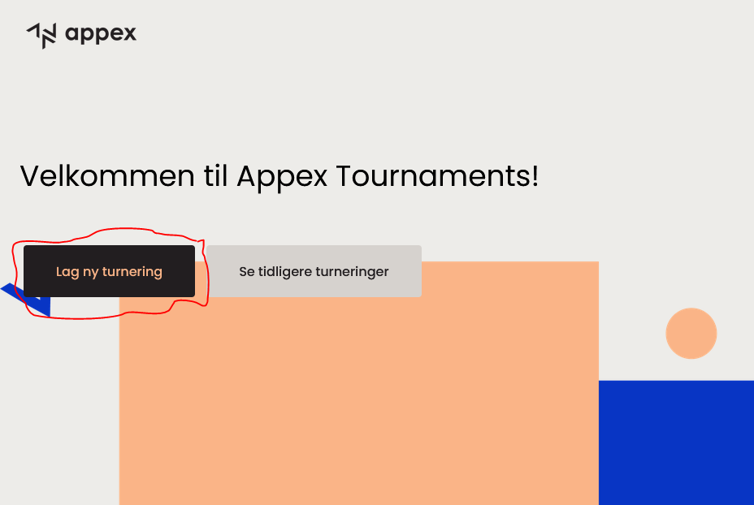
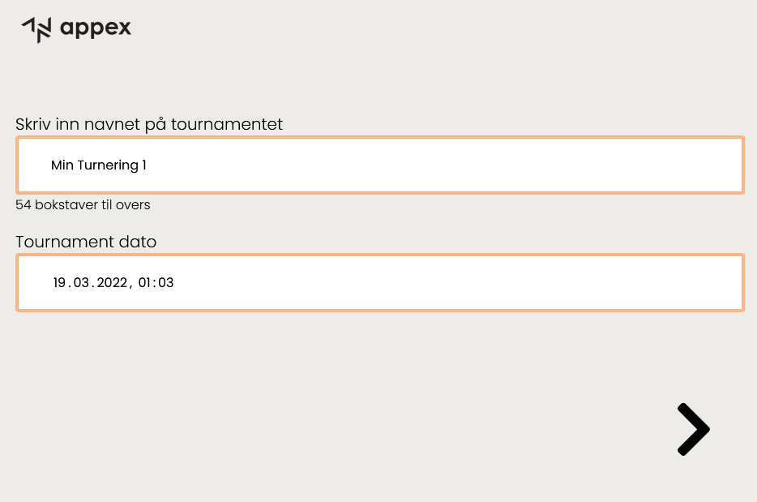
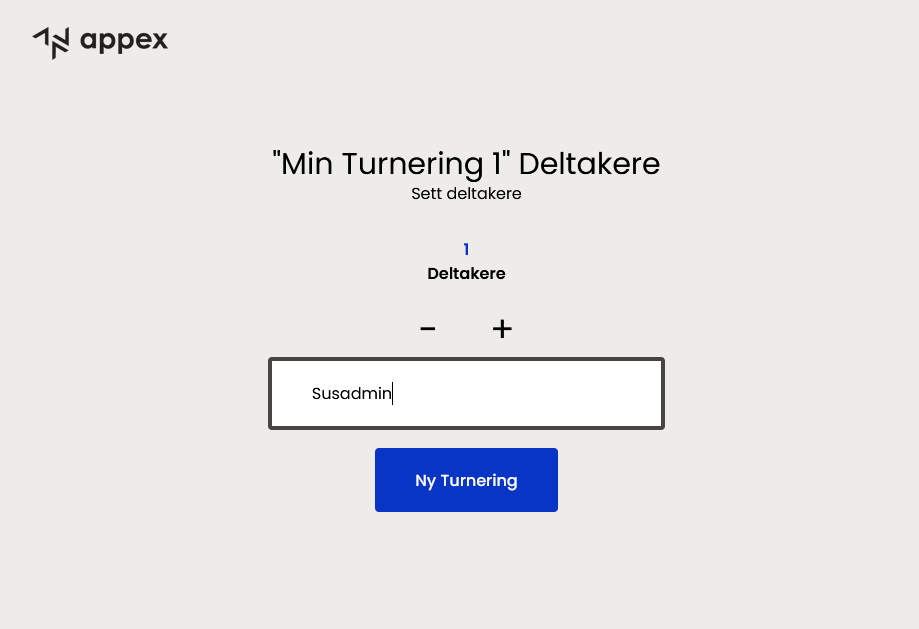
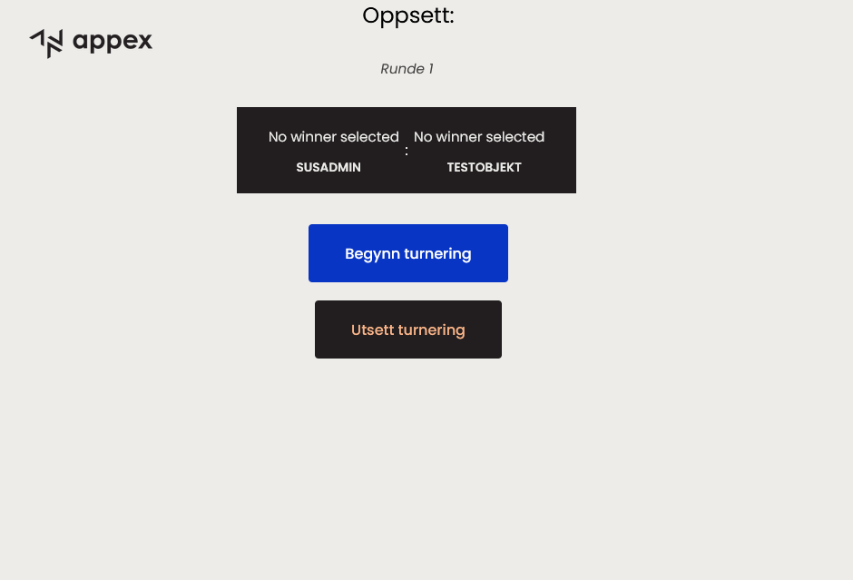
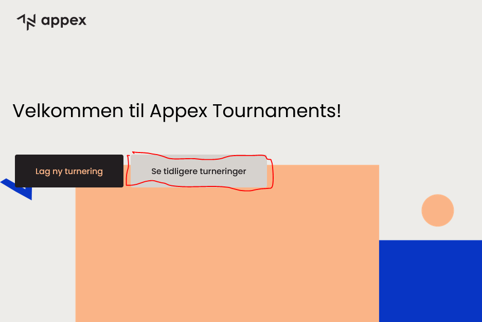
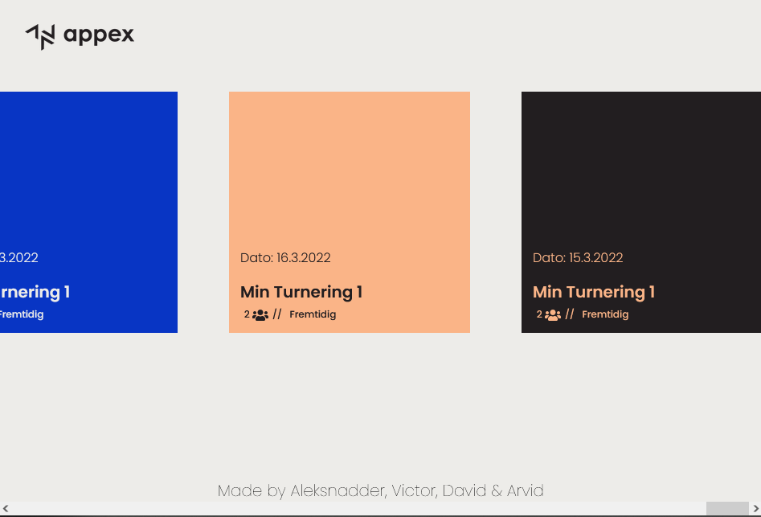
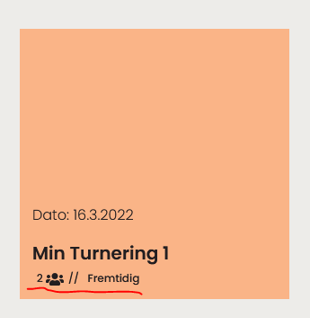
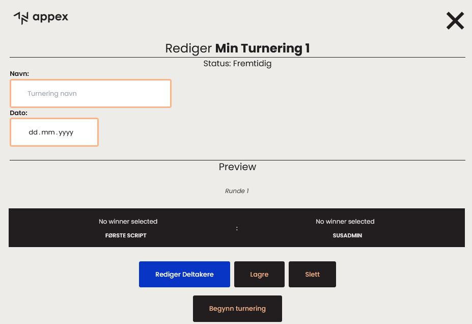

<h1 align="center">Velkommen til Appex Tournaments!</h1>
<h1 align="center">- Innhold -</h1>

<div align="center">

[The Quest (Oppgaven)](#Oppgave)

[Hvordan lager jeg ny turnering?](#Hvordan-lager-jeg-ny-turnering?)

[Tidligere Turneringer](#Tidligere-Turneringer)

[Hvordan redigerer jeg en turnering?](#Hvordan-redigerer-jeg-en-turnering?)

</div>

<a align="center" href="https://appextournament.netlify.app/">Link til Appex Tournaments</a>

## Oppgave 

Appex Tournaments!Her skal dere lage en turneringsapp!
Skal fungere noenlunde som https://challonge.com/
Ønsker at dere benytter Nuxt 3 for frontend https://v3.nuxtjs.org/
### Deloppgaver:
- Avklare roller i prosjektet
	- Prosjektleder (gir en oppdatering til meg på status hver onsdag)
	- Designer
	- Backend-utvikler
	- Frontend-utvikler
- Avklare hvilke skjermbilder som trengs. F.eks:
	- Registrering av navn på turnering + spillere
	- Forhåndsvisning av turneringsløpet (bracket)
	- Skjermbilde hvor man kan registrere utfall av kamper
	- Skjermbilde som viser turnerlingsløpet + neste kamp/spill
	- Flere?
- Sette opp et design på dette i Ligma. Bør følge Appex sin stil og tone. Minimalistisk og pent. Sender PDF med oppdatert profil.
- Finn ut hvordan dere ønsker å lagre data.
- Finn ut hvilken teknologi som skal benyttes for backend.
- Kan man bruke eksisternede open-source kode for å lette på arbeidet her? Google f.eks: Vue bracket component elns.
- Begynne med et enkelt proof-of-consept.
- Tenk ut en god  datamodell for backend (nødvendige objekter og felter). F.eks trenger man en tabell for tournaments - med Id, tittel, dato, osv.
- Kode CRUD logikken for datamodellen, og sette opp sette opp api endepunkter i backend for dette (hente ut og lagre nye data). F.eks trenger man POST /api/tournaments og GET /api/tournaments/id/ etc.
- Lage frontend pages og komponenter som får på plass de nødvendige skjermbildene
- Sende og hente nødvendig data mellom frontend og backend.
- Teste og justere.
- Kalle inn til første test-turnering "Appex Biljard 2022"  :D


<h3 align="center">Roller:</h3>

<p align="center">Frontend: Aleksnadder</p>
<p align="center">Backend: Arvid</p>


<h1 align="center">How to use Abbegs Tournaments</h1>

<h1 align="center"> Hvordan lager jeg ny turnering?
  
<p>For å opprette en ny turnering, trykk "Lag ny turnering"</p>



<h1></h1>

Deretter oppgi ønsket navn og dato.
OBS Navn kan ikke inne være lenger enn 69 karakterer.




Trykk deretter på pilen videre

#

Velg så antatt deltakere ved å trykke på ```[+]``` eller ```[-]```



Klikk deretter på _**```Ny Turnering```**_

#

Du vil/burde (vis APIet funker) da få opp ett oppsett av turneringen.



Trykk på ```Begynn turnering``` for å starte turneringen med en gang.

Du kan også trykke på ```Utsett turnering``` for å utsette turneringen. Du kan da finne turneringen under ```Tidligere Turneringer``` på forsiden.


#

Om du trykket ```Begynn turnering``` så vil/burde du få opp turneringen din.


For å velge en vinner av en match, trykker du på en av spillerene i matchen. 

NB *Neste runde vil først genereres etter at alle matchene på runden har en vinner.*


Du kan også trykke på ```Sett turnering på pause``` for å sette turneringen på pause. Du kan da finne turneringen under ```Tidligere Turneringer``` på forsiden og fortsette på den senere.


# Tidligere Turneringer

For å se dine tidligere turneringer, trykk på ```Se tidligere turneringer```.




#
Du vil da få opp en side med dine turneringer



#
Hver turnering viser hvor mange spillere som deltar og hvilken status turneringen har.




# Hvordan redigerer jeg en turnering?


For å redigere en turnering må du trykke på ```Se tidligere turneringer```.


#
Du vil da få opp en side med dine turneringer


#

Trykk så på turneringen du vil redigere.

Du vil da få opp en meny til å redigere turneringen.
Her kan du endre navn, dato (og spillere om turneringen ikke er påbegynt enda)

Trykk deretter ```Lagre``` for å lagre dine eventuelle endringer.



Du kan også trykke ```Slett``` for å la turneringen forsvinne på magisk vis.